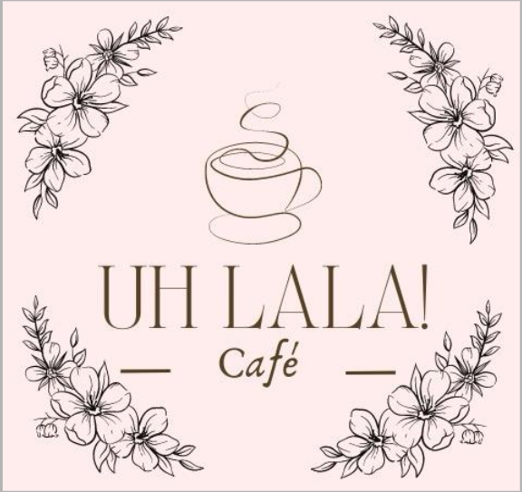

<div align="center">



# ☕ Uhlala Café — Landing Page Premium

**Café de especialidad · Pastelería casera · Terraza con vista a la ciudad · Macul Alto, Santiago**

[](https://github.com/Baastian0922/UhlalaCafe/actions/workflows/deploy.yml)
[](https://github.com/Baastian0922/UhlalaCafe/commits/main)
[](./LICENSE)


[🌐 Ver en Vivo](https://baastian0922.github.io/UhlalaCafe) · [🐛 Reportar Bug](https://github.com/Baastian0922/UhlalaCafe/issues/new?template=bug_report.md) · [✨ Solicitar Función](https://github.com/Baastian0922/UhlalaCafe/issues/new?template=feature_request.md)

</div>

---

## 📖 Descripción

Landing page premium y completamente responsiva para **Uhlala Café**, un café de especialidad único en Macul Alto, Santiago. El proyecto refleja la esencia íntima y cálida del negocio: mesas blancas, flores en cada rincón, hermosas vistas a la ciudad desde las alturas y atardeceres mágicos, todo atendido con amor por su propia dueña.

El sitio fue construido con **cero dependencias** de frameworks externos — HTML5, CSS3 nativo y Vanilla JavaScript — maximizando la velocidad de carga y la facilidad de mantenimiento.

---

## ✨ Funcionalidades Clave

| Función | Descripción |
|---|---|
| 🏆 **Diseño Premium** | Paleta rose-gold/platinum, glassmorphism, micro-animaciones |
| 📱 **Totalmente Responsivo** | Layouts adaptados para Desktop, Tablet y Móvil |
| 🔍 **Widget "Descubrir mi Taza"** | Quiz de 3 pasos que recomienda el café ideal |
| 📋 **Carta Interactiva** | Tabs con categorías: Cafés de Autor, Pastelería, Brunch |
| 🗺️ **Integración Google Maps** | Enlace directo a la ubicación en Macul Alto |
| 💬 **Acceso Directo WhatsApp** | Botón de contacto para consultas |
| 🔄 **Scroll-Spy** | Navegación activa que sigue el scroll del usuario |
| 📍 **Nav Flotante Móvil** | Barra de navegación inferior para dispositivos táctiles |
| ♿ **Accesibilidad** | Uso de `aria-label` y HTML semántico |
| 🚀 **CI/CD Automatizado** | Deploy automático a GitHub Pages con cada push a `main` |

---

## 📂 Estructura del Proyecto

```
UhlalaCafe/
│
├── .github/
│   ├── ISSUE_TEMPLATE/
│   │   ├── bug_report.md          # Plantilla para reportar errores
│   │   └── feature_request.md     # Plantilla para solicitar funciones
│   └── workflows/
│       └── deploy.yml             # CI/CD → Auto-deploy a GitHub Pages
│
├── assets/
│   └── images/
│       ├── logo.png               # Logo oficial Uhlala Café
│       ├── patio_sunset.png       # Terraza al atardecer (Hero)
│       ├── cafe_facade.png        # Fachada y dueña (Historia)
│       ├── rose_bench.png         # Rincón de flores (Atmósfera)
│       ├── hero_latte_art.png     # Latte art de especialidad
│       └── luxury_cafe_interior.png
│
├── css/
│   └── style.css                  # Sistema de diseño completo
│                                  # (variables, tokens, componentes, media queries)
│
├── js/
│   └── main.js                    # Toda la lógica de interacción
│                                  # (scroll-spy, menú, widget del café)
│
├── .editorconfig                  # Estilo de código consistente entre editores
├── .gitignore                     # Archivos excluidos del control de versiones
├── CHANGELOG.md                   # Historial de cambios (semver)
├── index.html                     # Punto de entrada principal (702 líneas)
├── LICENSE                        # Licencia MIT
├── package.json                   # Scripts de desarrollo y metadatos del proyecto
└── README.md                      # Esta documentación
```

---

## 🛠️ Stack Tecnológico

- **HTML5** — Estructura semántica, accesible y SEO-optimizada
- **CSS3 Nativo** — Variables custom (design tokens), Grid, Flexbox, animaciones, media queries
- **Vanilla JavaScript** — Sin frameworks; `IntersectionObserver`, manipulación del DOM, event delegation
- **FontAwesome 6** — Iconografía premium
- **Google Fonts** — Playfair Display (serif) + Inter (sans-serif)
- **GitHub Actions** — Pipeline CI/CD para deploy automatizado

---

## 🚀 Desarrollo Local

### Prerrequisitos
- [Node.js](https://nodejs.org/) v18+ (solo para el servidor de desarrollo)

### Instalación y ejecución
```bash
# 1. Clona el repositorio
git clone https://github.com/Baastian0922/UhlalaCafe.git
cd UhlalaCafe

# 2. Inicia el servidor de desarrollo local
npm run dev
# → Abre automáticamente http://localhost:3000
```

### Comandos disponibles
```bash
npm run dev        # Servidor de desarrollo con recarga en vivo
npm run serve      # Servidor estático alternativo
npm run format     # Formatea todo el código con Prettier
npm run validate   # Valida HTML y CSS
```

---

## 🔄 Flujo de Trabajo Git

```
main  ←  (deploy automático a GitHub Pages)
  │
  └── feat/nueva-seccion    # Nuevas funcionalidades
  └── fix/responsividad     # Correcciones de bugs
  └── style/animaciones     # Cambios visuales
  └── docs/readme           # Actualizaciones de documentación
```

**Convención de commits** ([Conventional Commits](https://www.conventionalcommits.org/)):
```
feat:    Nueva funcionalidad
fix:     Corrección de bug
style:   Cambios visuales (CSS, imágenes)
docs:    Cambios en documentación
refactor: Refactorización sin cambio de comportamiento
chore:   Tareas de mantenimiento (CI/CD, configs)
```

---

## 📱 Breakpoints Responsivos

| Dispositivo | Ancho máximo | Comportamiento |
|---|---|---|
| Desktop XL | > 1024px | Layout de 2 columnas, nav horizontal completa |
| Tablet | ≤ 1024px | Nav compacta, grids ajustados |
| Móvil | ≤ 768px | 1 columna, hamburger menu + nav inferior flotante |
| Teléfono pequeño | ≤ 480px | Fuentes reducidas, botones full-width |

---

## 🚢 Deploy

El sitio se despliega **automáticamente** a [GitHub Pages](https://baastian0922.github.io/UhlalaCafe) en cada push a la rama `main`, mediante el workflow definido en `.github/workflows/deploy.yml`.

Para activarlo por primera vez:
1. Ve a **Settings → Pages** en tu repositorio de GitHub.
2. Selecciona **Source: GitHub Actions**.
3. Haz cualquier push a `main` — el workflow se ejecutará automáticamente.

---

## 📸 Capturas de Pantalla

> _Sección para agregar screenshots del sitio en desktop y móvil._

---

## 🤝 Contribuciones

Las contribuciones son bienvenidas. Por favor, abre un **Issue** antes de hacer un Pull Request para discutir los cambios propuestos.

1. Haz fork del repositorio
2. Crea una rama: `git checkout -b feat/mi-mejora`
3. Commit con convención: `git commit -m "feat: descripción del cambio"`
4. Push a tu fork: `git push origin feat/mi-mejora`
5. Abre un Pull Request

---

## 📄 Licencia

Distribuido bajo la Licencia MIT. Ver [`LICENSE`](./LICENSE) para más información.

---

<div align="center">

Hecho con ☕ y ❤️ para **Uhlala Café** · Macul Alto, Santiago de Chile

</div>
